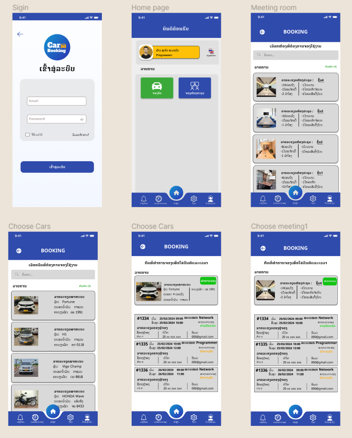

  # ในไลยะเวลาฝืกงาน (2เดือนกับ5วัน) 
  
  + ในไลยะเวลา "1-3 อาทิตย์ของกราเรี่มฝืกงาน" ผมได้ศึกษาเกี่ยวกับกานใช้ (Figma) ในกราออกแบบดีไซน์หน้าตาของแอปพลิเคชันมือถือ และ
    เว็บไซต์.
  
  + Figma เป็นเครื่องมือออกแบบอินเทอร์เฟซแบบทำงานร่วมกัน.
  
  + โดยที่ผมได้รับกราสอน และ คำแนะนำจาก พี่:สายเพชร.
  
  + พี่:สายเพชร ได้สอนกราใช้งานในส่วนของตัว แอพ "Figma" ไม่ว่าจะเป็นอุปะกอนพายในของตัวแอพมันใช้งานยัง และ         ออกแบบโปรเจ็คยังไงให้มันดูแอดวานซ์ และ ทันสมัยมากยิ่งขื้น.
   
  
  + รูบภาพของ แอพ (Figma)
  
  

  + รูบภาพของโปรเจ็กที่ได้ทำใน "Figma" โดยที่มีพี่สายเพชรให้คำแนะนำ และ เพื่อนๆอีก2คนช่วยกันทำจากที่ฝืกงาน (Jo & Anna).

  

  + รูบภาพของโปรเจ็กที่ได้ทำใน "Figma" ได้ลองออกแบบ และ ทำด้วยตัวเอง.

  

  + รูบภาพของ พี่:สายเพชร.

  

  # ในช่วงขั้นกรางเดือนของกราฝืกงาน 

  + ผมได้ลองศึกษาภาษา HTML และ CSS เพื่อนำไปใช้เขียนในโปรแกรม (VS Code) พร้อมทั้งดูผู้เชี่ยวชานในด้านกราเขียนโค้ดท่านอื่นพ่านทางสื่อออนไลน์.
  
  + ผมได้ได้รับคำแนนะนำในกราเขียนโค้ด และ หาข้อมูลหลายๆอย่างเกี่ยวกับแท็กทุกตัวใช้ยังงานไงจาก พี่:แฮ้ม.

  + รูบภาพของ แอพ (VS Code)

  

 
  # ในไลยะเวลา (3อาทิตย์สุดท้ายของกราฝืกงาน) 
  
  + เป็นช่วงที่ยาก และ ท้าทายมากสำหลับตัวผมมาก, ผมเรี่มศึกษา และ ทำความเข้าใจเกี่ยวกับกราใช้เครื่องมือ (React-Native) ในกราพัฒนาแอปพลิเคชันมือถือ.
  
  + ผมได้รับคำแนะนำจาก พี่:นิก.
  
  + พี่:นิก ได้บอกให้ผมเนั้นศึกษาตรงส่วนของกราติดตั้งตัวเครื่องมือ "React-Native" พร้อมกับใช้ตัวแอพ Android Studio เป็นโปรแกรมจำลองในกราสร้างแอพมือถือ และ ให้เนั้นศึกษาภาษา JavaScript.

  + รูบภาพของ (React-Native)
  